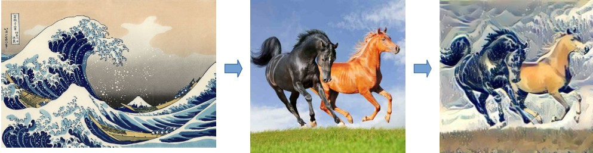

# Telegram Bot for Image Stylization

*[Read this document in Russian](README.ru.md)*

🎓 **Final project of the 1st-semester course at MIPT Deep Learning School (Spring 2025)**

* [Deep Learning School](https://dls.samcs.ru)
* [Course page on stepic.org](https://stepik.org/course/230362/info)


This bot provides a simple interface for users to apply neural network-based image stylization algorithms directly in Telegram. Two main modes are supported:

1. **Neural Style Transfer (NST)**

Style transfer using the algorithm by Leon A. Gatys.

**Description:**

* The user uploads two images:
    * A content image (the base image).
    * A style image (the style to be transferred).
* The bot applies NST and sends back the result, transferring the style onto the content image.
* The algorithm preserves the structure of the content image while adapting its visual style to match the style image.
* This algorithm produces high-quality results but is quite resource-intensive, especially on a CPU and with large images.

<details>
<summary>NST Examples:</summary>




</details>
<br><br>


2. **CycleGAN (Cycle-Consistent GAN)**

Transfers visual style between domains without paired images.

**Description:**

* The user uploads a single image.
* The bot applies a pre-trained CycleGAN model, for example:
    * Photo → Painting (in the style of Van Gogh, Monet, etc.)
    * Horse → Zebra
    * Summer → Winter
* The bot returns the transformed image, corresponding to the chosen stylization direction.
* This method is highly efficient and fast.

<details>
<summary>CycleGAN Examples:</summary>


</details>
<br><br>


## Table of Contents
- [Technologies Used](#used_tech)
- [Key Implementation Features](#important_features)
- [Setup and Launch](#bot_start)
    - [Running with Docker](#bot_docker)
    - [Deployment](#bot_deploy)
- [Bot Features and Functionality](#bot_functionality)
- [References and Materials](#style_transfer)
    - [Neural Style Transfer (Gatys' Algorithm)](#style_transfer_gatys)
    - [CycleGAN (Cycle-Consistent Adversarial Networks)](#style_transfer_cyclegan)
 - [TODO List](#bot_todo)

 <a name="used_tech"><h2>Technologies Used</h2></a>

* **Language:** Python
* **Framework:** aiogram
* **HTTP Server:** aiohttp
* **AI Framework:** PyTorch

<a name="important_features"><h2>Key Implementation Features</h2></a>

* ✅ Asynchronous request handling.
* ✅ Supports both polling and webhook modes.
* ✅ Uses an .env file for managing secrets.
* ✅ Includes a Makefile for convenient commands.
* ✅ Ready to run in a Docker container.
* ✅ No external databases or other persistent storage required.
* ✅ Confidentiality: User-uploaded images and generated results are not saved on the server after processing.
* ✅ Configurable CPU/GPU ("auto") settings and algorithm parameters via YAML files.
* ✅ Reliability: The NST and CycleGAN engines operate independently. An initialization error in one does not affect the other.
* ✅ No raw HTTPS traffic handling; a reverse proxy (like ngrok, DevTunnels, or Nginx) is required for webhook mode.

<a name="bot_start"><h2>Setup and Launch</h2></a>

**⚠️ Important Notes:**

* The repository does not include pre-trained models due to their large size. You will need to download them separately.
* The project relies on PyTorch, a large library. Be prepared to download approximately 6 GB of data when installing dependencies. The resulting Docker image will also be around 6 GB.

___

1. Clone the repository.

```
git clone https://github.com/idalgo-2021/dls_bot.git
```

2. Create and activate a virtual environment (recommended).

```
# Navigate to the project directory
cd dls_bot

# Create a virtual environment named venv
python -m venv venv

# Activate the virtual environment
source venv/bin/activate
```

3. Install the required dependencies.

```
pip install -r requirements.txt
```

4. Set up environment variables.

Create and configure an `.env` file (you can use `.env.example` as a template). To get started, you only need to set `TELEGRAM_BOT_TOKEN` and run the bot in `polling` mode.

```
# Paste your Telegram bot token here
TELEGRAM_BOT_TOKEN="YOUR_TOKEN_HERE"

# Bot run mode: "polling" or "webhook"
BOT_RUN_MODE="polling"

# Settings for webhook mode (if used)
# WEBHOOK_URL=...
# WEBHOOK_PORT=...
```

5. Download the pre-trained models.

**CycleGAN Models:**

* These models can be downloaded using the `utils/download_cyclegan_model.py` script.
* The list of available models is inside the script itself.
* After downloading, ensure they are correctly listed under `styles` in `app/configs/cyclegan_params.yml`. The models will be saved to `app/models/cyclegan/`.

```
# Download models for CycleGAN
python utils/download_cyclegan_model.py style_monet
python utils/download_cyclegan_model.py style_vangogh
```

**NST Model (VGG19):**

We recommend using a "shrunk" version of the VGG19 model. It produces similar quality results but is only 2.1 MB instead of 548 MB.

* To download the recommended shrunk model (2.1 MB):

```
python utils/shrinker_vgg19.py
```

* If you need the full VGG19 model (548 MB): You can download it from this link - - [VGG19 (vgg19-dcbb9e9d.pth)](https://download.pytorch.org/models/vgg19-dcbb9e9d.pth). If you use it, be sure to set `MODEL_TYPE` in `app/configs/nst_params.yml` to "full_statedict".

6. Run the bot.

```
# Command to start the application
python -m app.bot
```

<a name="bot_docker"><h3>Running with Docker</h3></a>

Use the provided Makefile for easy local execution inside a Docker container:

```
# Main commands

# Build the Docker image
make build 

# Run the Docker container in polling mode
make run 

# Run the Docker container in webhook mode
make run-webhook
```

<a name="bot_deploy"><h3>Deployment</h3></a>

* It is recommended to set up a deployment process using Git, building the Docker image directly on the remote server (given the size of PyTorch and the models). The pre-trained models should be copied to the VPS and mounted as a volume.
* For webhook mode, you'll need a reverse proxy like Nginx to handle HTTPS traffic and forward it to the bot's HTTP server.

<details>
<summary>Example of my CI/CD and deployment process on an AWS VPS:</summary>

For deployment, I used an AWS VPS (vCPU: 2, RAM: 2 GB, SSD: 60 GB) without a GPU.

My CI/CD pipeline is built using GitHub Self-hosted runners, where the build process runs directly on the VPS. The pre-trained models are stored on the server and mounted into the Docker container during runtime. You can see the setup in .github/workflows/deploy-on-vps.yml.

I set up an Nginx reverse proxy on the VPS to handle raw HTTPS traffic. Since I didn't use a dedicated domain, I generated a self-signed certificate and passed its path to the container via the WEBHOOK_CERT_PATH environment variable.

Here are the scripts to run the Docker container:

**Polling Mode:**

```
docker run -d \
  --name dls_bot_instance \
  --restart unless-stopped \
  --env-file /home/ubuntu/dls_bot_config/.env \
  -v /home/ubuntu/dls_bot_data/models:/usr/src/app/app/models \
  dls_bot_vps:latest 
```

**Webhook Mode:**

```
docker run -d \
  --name dls_bot_instance \
  --restart unless-stopped \
  -p 2000:2000 \
  --env-file /home/ubuntu/dls_bot_config/.env \
  -v /home/ubuntu/dls_bot_data/models:/usr/src/app/app/models \
  -v /etc/nginx/ssl/nginx-selfsigned.pem:/certs/nginx-selfsigned.pem:ro \
  dls_bot_vps:latest
```

</details>

<a name="bot_functionality"><h2>Bot Features and Functionality</h2></a>

**General Commands:**

* **/start:** Displays a welcome message and an overview of the bot's features.
* **/help:** Shows a list of all available commands.
* **/cancel:** Cancels the current operation (useful for the NST or CycleGAN flows).

**Special Commands:**

* **/nst:** Starts the Neural Style Transfer flow. The bot will ask you to choose a pre-defined style or upload your own, and then to upload a content image.
* **/cyclegan:** Starts the CycleGAN flow. The bot will ask you to select a style and then upload a content image to apply it to.

**Note:** If you send any other text, the bot will act as an echo server and simply repeat your message. For convenience, both the NST and CycleGAN flows include a "Cancel" button.

<a name="style_transfer"><h2>References and Materials</h2></a>

<a name="style_transfer_gatys"><h3>Neural Style Transfer (Gatys' Algorithm)</h3></a>


* Paper on arxiv.org: [A Neural Algorithm of Artistic Style](https://arxiv.org/abs/1508.06576)
* PyTorch Tutorial: [Neural Transfer Using PyTorch](https://docs.pytorch.org/tutorials/advanced/neural_style_tutorial.html)
* [Adapted Tutorial Notebook](./docs/neural_style_tutorial.ipynb)  


<a name="style_transfer_cyclegan"><h3>CycleGAN (Cycle-Consistent Adversarial Networks)</h3></a>

* Recommended Article: [Understanding and Implementing CycleGAN in TensorFlow](https://hardikbansal.github.io/CycleGANBlog/)
* Paper on arxiv.org [Unpaired Image-to-Image Translation
using Cycle-Consistent Adversarial Networks](https://arxiv.org/abs/1703.10593)
* GitHub Repository: [https://github.com/junyanz/pytorch-CycleGAN-and-pix2pix] - *The code for ResnetGenerator and ResnetBlock in `app/architectures/cyclegan_networks.py` was adapted from this repository.*.


<a name="bot_todo"><h2>TODO List</h2></a>

1. **FSM Timeouts:** Add timeouts to automatically cancel "stuck" user sessions.
2. **NST Refactoring:** Process images in-memory (io.BytesIO) instead of saving them as temporary files, similar to the CycleGAN implementation.
3. **Performance Improvements:** Optimize Docker resource limits and explore performance on a VPS with CUDA support.
4. **Expand Functionality:** Add new stylization methods, algorithms, and network types.
5. **Modularity:** Consider refactoring into microservices for better scalability, maintainability, and testing.
6. **Monitoring:** Implement logging, metrics, and alerts.
7. **Continuous Refactoring:** Consistently improve and clean up the codebase.